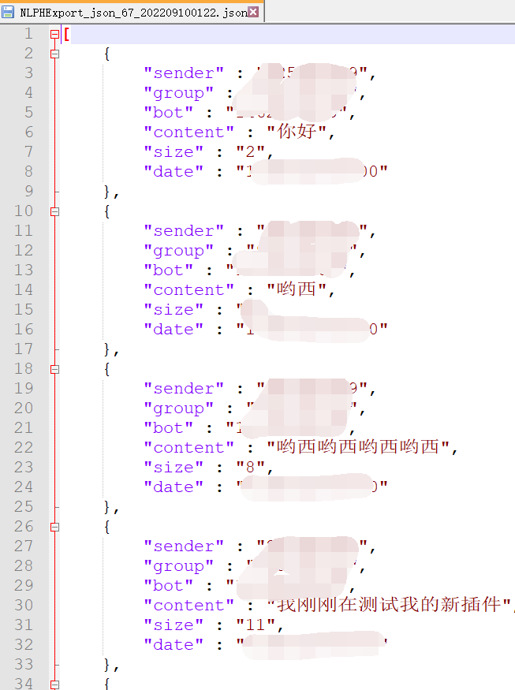
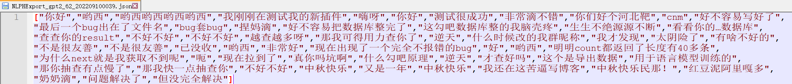

# NLP Helper

> 适用于 [Mirai](https://github.com/mamoe/mirai) 的用于收集NLP语言训练数据的插件。

### [Github Project]()
### [Release]()
### [MiraiForum]()

## 介绍

### 什么是NLP?

以下内容摘自[百度百科](https://baike.baidu.com/item/%E8%87%AA%E7%84%B6%E8%AF%AD%E8%A8%80%E5%A4%84%E7%90%86/365730)

> 自然语言处理( Natural Language Processing, NLP)是计算机科学领域与人工智能领域中的一个重要方向。它研究能实现人与计算机之间用自然语言进行有效通信的各种理论和方法。自然语言处理是一门融语言学、计算机科学、数学于一体的科学。因此，这一领域的研究将涉及自然语言，即人们日常使用的语言，所以它与语言学的研究有着密切的联系，但又有重要的区别。自然语言处理并不是一般地研究自然语言，而在于研制能有效地实现自然语言通信的计算机系统，特别是其中的软件系统。因而它是计算机科学的一部分 [1]  。
自然语言处理主要应用于机器翻译、舆情监测、自动摘要、观点提取、文本分类、问题回答、文本语义对比、语音识别、中文OCR等方面 [2]  。

### 起因

我前一段时间发布的帖子: [关于将QQ机器人与深度学习NLP结合的可能性](https://mirai.mamoe.net/topic/1586/%E5%85%B3%E4%BA%8E%E5%B0%86qq%E6%9C%BA%E5%99%A8%E4%BA%BA%E4%B8%8E%E6%B7%B1%E5%BA%A6%E5%AD%A6%E4%B9%A0nlp%E7%BB%93%E5%90%88%E7%9A%84%E5%8F%AF%E8%83%BD%E6%80%A7)

### 目的

制作一个**专用**于收集NLP语言模型训练数据、方便查询和导出数据的插件。

## 功能

- 收集指定群里的聊天数据 (仅支持 `PlainText`)
- 自动过滤emoji，并支持在配置中通过正则表达式进行简单过滤
- 支持导出`JSON`格式的数据
- 支持**直接导出**模型需要的训练数据的格式 (目前暂时仅支持 [`GPT2-Chinese` 模型](https://github.com/Morizeyao/GPT2-Chinese))
- 完全隐蔽式收集数据，聊天环境下**所有**命令均无回应
- 数据库安全，相关命令仅限控制台

## 声明

本插件开发目的为学习，在开始采集数据前请先告知群成员，采集所得数据必须保证只在机器学习上使用。严禁用于任何侵犯他人隐私和过度滥用的行为，若因此出现问题本人概不负责。

## 快速使用

- 从 [Release]() 下载本插件并放置于mcl的plugins目录下
- 登录机器人后，在控制台输入以下命令开始采集数据
    ```shell
    /NLPHelper addGroup 你需要采集数据的群
    ```
- 采集数据 (这通常需要花上数周甚至数月)
- 在控制台输入以下命令导出gpt2数据
    ```shell
    /NLPHelper export gpt2
    ```
- 前往 `mcl根目录\NLPH\out\ ` 找到刚才导出的数据
- 进行模型训练 (这一部分的教程会在之后补充)

## 命令

注意:  
本插件**不推荐**与其他**任何**插件一同使用，包括 [Chat-Command](https://github.com/project-mirai/chat-command)

命令均为 `/NLPHelper <子命令> [参数...]`或使用缩写别名 `/nlph <子命令> [参数...]` 。

### 配置修改命令

| 命令                                         | 描述        |
|:-------------------------------------------|:----------|
| `/NLPHelper addGroup <group>`              | 添加收集数据的群  |
| `/NLPHelper removeGroup <group>`           | 移除群       |
| `/NLPHelper outDir <path>`                 | 修改默认输出位置  |
| `/NLPHelper defaultFileName <fileName>`    | 修改默认输出文件名 |
| `/NLPHelper addFilter <filter>`            | 添加过滤词     |
| `/NLPHelper removeFilter <filter>`         | 移除过滤词     |
| `/NLPHelper addConfig <name> <sql> [type]` | 新建导出配置    |
| `/NLPHelper removeConfig <name>`           | 删除导出配置    |


| 参数         | 类型     | 描述        | 备注                                     |
|:-----------|:-------|-----------|----------------------------------------|
| `group`    | Long   | 启用或移除的群号  |                                        |
| `path`     | String | 默认导出数据的位置 | mcl根目录，默认为`./NLPH/out/`                |
| `fileName` | String | 默认导出的文件名  | 默认为`NLPHExport_{model}_{count}.json`   |
| `filter`   | String | 需要过滤的字符   | 支持正则表达式                                |
| `name`     | String | 导出配置的名字   | 大小写敏感，自带三个导出配置 `default`、`json`和`gpt2` |

### `fileName` 文件名变量

| 变量           | 描述                                      |
|:-------------|:----------------------------------------|
| `{model}`    | 选择导出的方式，如: json                         |
| `{count}`    | 导出数据数量，如: 114514                        |
| `{date}`     | 导出的日期 (yyyyMMdd)，如: 20220910            |
| `{time}`     | 导出的时间 (HHmm)，如:0930                     |
| `{datetime}` | 导出的日期和时间 (yyyyMMddHHmm)，如: 202209100930 |

注意:  
若要在聊天环境中使用，需要授予相关权限

### 数据库相关命令

| 命令                                                        | 描述          |
|:----------------------------------------------------------|:------------|
| `/NLPHelper query [sql]`                                  | 查询          |
| `/NLPHelper execute <sql>`                                | 执行sql语句     |
| `/NLPHelper export [config] [outDir] [fileName]`          | 使用导出配置进行导出  |
| `/NLPHelper exportByConfig [config] [outDir] [fileName]`  | 使用导出配置进行导出  |
| `/NLPHelper exportBySQL [sql] [type] [outDir] [fileName]` | 使用sql语句进行导出 |


| 参数       | 类型     | 描述      | 备注                           |
|:---------|:-------|---------|------------------------------|
| `sql`    | String | SQL语句   | 默认为`SELECT * FROM NLPH;`     |
| `config` | String | 导出配置的名字 | 默认为`default`，即导出json         |
| `type`   | String | 导出类型    | 默认为`json`，目前仅支持`json`和`gpt2` |

注意:  
本命令仅支持控制台使用。  
所有sql输入均未作判断和处理直接执行，如有语法问题会catch并报错。其余指令存在sql注入风险，但没必要，因为你可以直接使用`execute`。

## 导出样例

### json



### [gpt2](https://github.com/Morizeyao/GPT2-Chinese)



注意:   
若追求更好的效果，仍需再进一步过滤噪声

## 数据表

表名为 `NLPH`  

| 参数        | 类型        | 描述       |
|:----------|:----------|----------|
| `sender`  | Long      | 发送者QQ号   |
| `group`   | Long      | 消息所在群QQ号 |
| `bot`     | Long      | 相关机器人QQ号 |
| `content` | String    | 消息内容     |
| `size`    | Int       | 消息长度     |
| `date`    | LocalDate | 消息发送日期   |

### 用例

```shell
#查询 123456 发送的消息
/NLPHelper query "SELECT * FROM NLPH WHERE sender=123456;"

#以json格式导出群 456789 的消息
/NLPHelper exportBySQL "SELECT * FROM NLPH WHERE group=456789;" json

#以gpt2格式导出 100 字以内的消息
/NLPHelper exportBySQL "SELECT * FROM NLPH WHERE size<=100;" gpt2

#以json格式导出日期在 2022年8月1日-2022年9月1日 且属于机器人 114514 的消息，且仅导出发送人和消息内容
/NLPHelper exportBySQL "SELECT sender,content FROM NLPH WHERE (date BETWEEN 20220801 AND 20220901) AND bot=114514;" json
```

更多高级的使用方法请自行去学习 [SQLite](https://www.runoob.com/sqlite/sqlite-tutorial.html)

## 插件配置

位于`\config\net.reincarnatey.NLPHelper\NLPHConfig.yml`

```yaml
# 要开启记录消息的群
group:
  - 123456
# 当检测到以下内容时不记录该消息，支持正则表达式
filter:
  - '/'
  - '#'
  - http
# sql查询语句的配置，数据表详细与简单的sql教程在README.md
config:
  default:
    sql: 'SELECT * FROM NLPH;'
    type: json
  json:
    sql: 'SELECT * FROM NLPH;'
    type: json
  gpt2:
    sql: 'SELECT * FROM NLPH;'
    type: gpt2
# 默认导出数据的位置
outDir: './NLPH/out/'
# 存放数据库的位置，更改后记得移动NLPH.db至新的位置，重启生效
dbDir: './NLPH/data/'
# 默认文件名，模板参数请读README.md
defaultFileName: 'NLPHExport_{model}_{count}.json'
```

## 再次声明

本开源插件仅为个人使用而编写，遵循`Apache Licence2.0`开源协议，发布至 [MiraiForum](https://mirai.mamoe.net/) ，禁止用于任何违法法律法规、社区规定、网站规则的行为，若出现问题本人概不负责。

## qwq
后续如果有空大概会发布如何使用导出来的数据训练。  

下一个支持直接导出的模型可能是 [`GPT2-chitchat`](https://github.com/yangjianxin1/GPT2-chitchat)  
有需要的话也可以自行修改源码实现 (不过这一部分源码的方法并不友好，本来想尝试使用泛型接口但以失败告终)  

如果有bug的话可以回复或者提issue